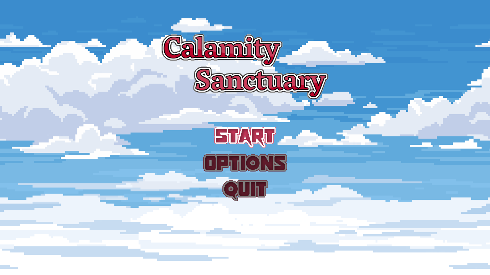
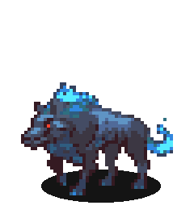
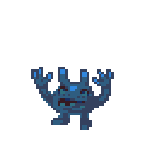

This month was focused on adding bosses and adding a couple new assets. Progress has been a bit slow in April but things should pick up in June.

### New Bosses

After all this time, we finally have 2 bosses : The Earth Golem and the Ice Golem.

#### Earth Golem

<video autoplay loop src="../assets/april_earthGolem.webm"></video>

Slow but a hard hitter, the Earth Golem excels at throwing rock based projectiles. Once it gets to half health, it'll attack more frequently with tougher patterns to dodge.

#### Ice Golem

<video autoplay loop src="../assets/april_iceGolem.webm"></video>

The golem residing on the icy planet Izit. Bit faster than the Earth Golem, and some of his attacks will slow players down. When at half health, will turn the middle row into ice, making it harder for players to evade attacks.

### New backgrounds

As you may have noticed in the previous images, the battle background has changed, with the capability implemented to easily replace this background with several other parallax backgrounds I have available.. Similarly, the main menu background has also changed.

### New Enemies

Finally, I've started leveraging existing enemies and doing palette swaps with modified behaviors to create new enemies. For the Ice World, we have 2 enemies so far. 

<video autoplay loop src="../assets/ice_enemies.webm"></video>

### Conclusion

That's it for this month! Short and sweet.